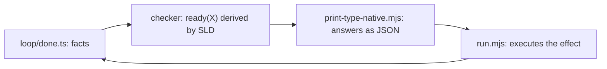

# ts-prolog


Prolog running inside the TypeScript type checker. Clause databases, unification,
SLD resolution with backtracking, cut, negation-as-failure, dynamic assert/retract,
findall, and arithmetic — all evaluated by `tsc --noEmit`. No codegen, no plugins,
no runtime.

```ts
import type { Query } from "ts-prolog";

type Src = [
  "parent(tom, bob)",
  "parent(bob, ann)",
  "ancestor(X, Y) :- parent(X, Y)",
  "ancestor(X, Z) :- parent(X, Y), ancestor(Y, Z)",
];
type A = Query<"ancestor(A, ann)", Src>;
//   ^? [["ancestor", "bob", "ann"], ["ancestor", "tom", "ann"]]
```

Hover-friendly examples live in demos/playground.ts. `npm run check` (tsgo, 1.4s)
and `npm run check:tsc` (3.0s) verify 12 test suites and 7 demo files.

## TOC

- [What works](#what-works)
- [Racing SWI-Prolog](#racing-swi-prolog)
- [Where it stops](#where-it-stops)
- [Which TypeScript](#which-typescript)
- [Demos: types that enforce rules](#demos-types-that-enforce-rules)
- [Closing the loop: types that cause effects](#closing-the-loop-types-that-cause-effects)
- [Engine internals](#engine-internals)
- [Layout](#layout)
- [Non-goals](#non-goals)

## What works

Two input surfaces, one engine. Strings are sugar; the tuple encoding
(`["parent", "tom", Var<"X">]`) is what the machine runs.

| Prolog piece | how | status |
| --- | --- | --- |
| terms | string/number literals, `Var<N>`, tuples | done |
| unification + occurs check | subst threaded through conditionals, worklist occurs walk | done |
| clause DB, SLD search, backtracking | choicepoint-stack machine (src/04-machine.ts) | done |
| cut | `"!"` -> stack-truncation barrier | done |
| negation, once, meta-call | library clauses; a var as a goal executes its binding | done via cut |
| asserta / assertz / retract | frame-local DB rebuilt per continuation | done; backtracking undoes changes (SWI asserts survive) |
| findall/3 | sub-derivation inside a machine step | done, sees the dynamic DB; copy semantics match SWI (free goal vars are not aliased into answers) |
| arithmetic: plus/3, times/3, lt/2, neq/2 | native number literals, tuple-length math; plus and times are relational (times division must be exact) | done, operands bounded 999, products bounded 9999 |
| between/3 | choicepoint per value, ascending | done, spans bounded 998 values |
| higher-order goals | var in functor position; `maplist` runs forwards AND backwards | done |
| surface syntax | type-level recursive-descent parser: `f(X)`, `[H\|T]`, `_` fresh vars, digit atoms as numbers, `!` | done (src/05-parse.ts) |
| prelude | `not/once/member/append/select/length` as `Prelude` | done (src/06-prelude.ts) |
| setof | `Distinct<Answers>` post-pass | lite |
| staged evaluation | `Pump<St, M>` chains paused machine markers across type aliases, one instantiation budget each | done; solves full zebra in 30 stages |

## Racing SWI-Prolog

`npm run race`: SWI-Prolog 10.0.2 solves each problem and emits answers as
JSONL; generated `Equal` assertions force tsgo to solve the same query and
prove answer-for-answer, order-for-order agreement; a third lane extracts
answers back out of the checker and diffs them against SWI. All 12 problems,
all lanes: exact match.

| problem | answers | swipl | tsgo | agree |
| --- | --- | --- | --- | --- |
| append splits of an 8-list | 9 | 75ms | 397ms | yes |
| ancestor over a 10-chain | 10 | 33ms | 549ms | yes |
| peano pairs summing to 6 | 7 | 36ms | 398ms | yes |
| towers of hanoi, 3 disks | 1 (7 moves) | 40ms | 471ms | yes |
| permutations of a 4-list | 24 | 37ms | 1526ms | yes |
| 3-coloring Australia (6 regions) | 6 | 38ms | 739ms | yes |
| naive reverse of a 6-list | 1 | 38ms | 460ms | yes |
| mini-zebra, 3 houses (who owns the fish) | 1 | 33ms | 626ms | yes |
| findall + peano count of kids per parent | 3 | 37ms | 437ms | yes |
| 5-queens (native number arithmetic) | 10 | 31ms | 3962ms | yes |
| pythagorean triples, legs to 13 (between + times) | 4 | 30ms | 1771ms | yes |
| full 5-house zebra puzzle, all 14 clues (staged: 30 Pump aliases) | 1 | 30ms | 47s | yes |

Wall clock is mostly process startup on both sides (swipl 67ms, npx+tsgo
~400ms warm); net solve is tens of ms for both at these sizes. The real gap
is capacity: SWI runs these at n in the millions, the checker runs out of
fuel (see [engine internals](#engine-internals)).

<details>
<summary>How the race verifies, and how answers get OUT of the type system</summary>

Pipeline per problem, orchestrated by bench/race.sh:

1. `swipl -q -g main bench/progs/<p>.pl` prints one JSON line per answer.
2. bench/gen_ts.py converts that JSONL into two files: a `.test-d.ts` with
   an `Expect<Equal<Out, Want>>` assertion (tsgo must reproduce SWI's
   answers exactly, order included), and a `.query.ts` with no expected
   value at all.
3. tools/print-type-native.mjs opens the `.query.ts` through the compiler
   API, evaluates the `Out` alias, and prints it. Terms are literals and
   tuples, so the printed type text is valid JSON.
4. bench/compare.py normalizes (uncons lists, unpeano numerals) and diffs
   against SWI's JSONL. Any mismatch exits nonzero; CI fails on any
   unverified lane.

Extraction rides an undocumented API: `tsgo --api` is a hidden subcommand,
and `@typescript/native-preview/unstable/sync` ships a msgpack-RPC client
whose `Project.checker` exposes `getTypeAtLocation` and `typeToString`
(`NoTruncation`). That is the Go compiler itself answering the query,
160-1600ms per problem, 2-6x faster than the retired typescript-5.9
compiler-API lane (tools/print-type.mjs, kept for reference).

</details>

## Where it stops

Bisected ceilings, exact to the unit (bench/limits/probe.py; raw runs in
bench/limits/results.jsonl). SWI runs every row at n orders of magnitude
higher; each ceiling below is a checker limit, and each maps to one of three
walls.

| probe | last pass | first fail | error | wall |
| --- | --- | --- | --- | --- |
| plus operand value | 999 | 1000 | TS2589 | Rep tail-recursion cap: `Rep<1000>` is 1000 non-fuel-chunked iterations |
| plus result value (X + n = 2n) | 998 (n=499) | 1000 | TS2589 | same cap, reached through `Rep<2n>` |
| times product | 9801 (99x99) | 10000 (100x100) | TS2799 | tuple hard cap at 10000 elements |
| times division (n * Y = n^2) | n=31 (961) | n=32 (1024) | TS2589 | Rep cap again, on the product operand |
| between span | 998 | 999 | TS2589 | Rep cap on the bound |
| unification nesting depth `f(f(...))` | 95 | 96 | TS2589 | Unify recurses per nesting level, not fuel-chunked |
| parser nesting depth `f(f(...))` | 91 | 92 | TS2589 | same shape in the template-literal parser |
| parser flat arity `f(a, ..., a)` | 500+ | - | - | flat scans are tail-recursive, no wall found |
| flat conjunction goal count | 303 | 304 | TS2589 | per-step goal-list rewrite, work = steps x state; indexing's per-goal bucket scan cost one unit here (was 304) |
| naive reverse list length | 32 | 33 | TS2589 | O(n^2) steps on a growing term (was 30 pre-indexing) |
| ancestor chain length | 48 | 49 | TS2589 | answer tuple + goal list both grow with n (was 38 pre-indexing) |
| n-queens | 5 | 6 | TS2589 | search volume x state size (was 4 pre-indexing) |
| 5-house zebra clue count, single alias | 5 of 14 | 6 | TS2589 | search volume x state; clue reordering (10x fewer SWI inferences), attribute-list and staged-predicate reformulations all still die single-alias |
| 5-house zebra, staged across 30 aliases | 14 of 14 | - | - | solved: `[["zebra", "german"]]`, 47-86s, ~5GB, raced vs SWI exact |

The v5 structure-sharing experiment (src/07-machine-v5.ts) and the v6
compaction sweep (src/08-machine-k.ts, `QueryMK<G, DB, K>` compacts every K
steps) move the same walls instead of removing them, in opposite
directions per workload. The full curve, v4 at one end and v5 at the
other:

| probe | v4 (shipped) | K=4 | K=16 | K=64 | v5 |
| --- | --- | --- | --- | --- | --- |
| flat conjunction goal count | 303 | 600+ | 1000+ | 1600+ | 1610 |
| naive reverse list length | 32 | 26 | 26 | 6 | 6 |
| ancestor chain length | 48 | 44 | 43 | 49 | 43 |
| 5-queens | pass, 4.3s | pass, 2.6s | pass, 3.6s | TS2589 | TS2589 |
| 5-house zebra clue count | 5, 3.4s | 5, 2.5s | 5, 4.7s | 5, 9.2s | 5, 8.6s |

Same answers, same order, on everything the engines share
(tests/machine-v5.test-d.ts pins v5). The split is the per-step cost
model: v4 pays O(goal-list) rewriting every step, v5 pays walk chains
whose depth follows data flow, v6 interpolates. Two facts fall out of the
sweep: no K dominates v4 (the accumulator ceiling never recovers past 26),
and zebra clue 6 dies at every point on the curve, so zebra's wall is
search volume rather than rewrite strategy. Accumulator recursion is the
worst case for chains and the reason v4 stays the shipped engine.

Peak checker RSS scales with the grind: passing runs near a wall hit 3-4GB
(flat n=304: 3.6GB; nrev n=30: 3.5GB). One engine bug fell out of the
between probe: embedding a lazy `Sum<L, 1>` in the retry goal chained
`Sum<Sum<...>>` one level per generated value and died at 31; forcing it to
a literal first (`extends infer L2 extends number`) moved the ceiling to 998.

## Which TypeScript

Two distributions of the same Go compiler are installed; they serve
different roles here.

| package | version | ships | used for |
| --- | --- | --- | --- |
| `typescript` | 7.0.2 stable | `tsc` shim around the Go binary; no JS API (lib/ is 5 files) | `npm run check:tsc` |
| `@typescript/native-preview` | 7.0.0-dev nightly | `tsgo` binary, hidden `--api` mode, `unstable/*` API exports | `npm run check`, answer extraction |

The compiler API lives only in the nightly channel for now (the export path
is literally named `unstable`). When it graduates to stable v7, extraction
should work against `typescript` proper by swapping one import.

## Demos: types that enforce rules

The enforcement device is a phantom rest parameter that becomes `[never]`
when a query has no solutions: a violated rule is an ordinary type error at
the call site. Every negative case is pinned with `@ts-expect-error`.

| demo | rule set | rejected at compile time |
| --- | --- | --- |
| demos/rbac.test-d.ts | grants + transitive role inheritance | `act("viewer", "delete")` |
| demos/typestate.test-d.ts | state-transition facts over op lists | `exec(["open", "close", "read"])` |
| demos/sql.test-d.ts | column facts, fk joinability; row types derived by query | `join("users", "users")` |
| demos/di.test-d.ts | dependency lists + recursive `wired` | `resolve("worker")` (missing `queue`) |
| demos/semver.test-d.ts | shared logic var across goals = constraint solver | `install("v3")` |
| demos/exhaustive.test-d.ts | derived handled-set vs a union | `Exclude` names the missing `"keydown"` |

## Closing the loop: types that cause effects

`node loop/run.mjs`: the checker plans, a runner acts, results become facts.



Each cycle re-queries `ready(A)` over edge/done facts (NAF excludes finished
steps), executes the first answer's effect, appends `done(step)` to the
generated facts file, and repeats to fixpoint. Effects are proof-gated: a
program that fails to typecheck runs nothing. Each cycle re-queries a small
delta, never the history.

## Engine internals

Four engines were built; each earlier one died against a different limit of
the checker's execution model. Everything below is verified by probes whose
commands live in the git history.

<details>
<summary>Engine history: the four walls, and the trampoline that works</summary>

| commit | engine | died at | lesson |
| --- | --- | --- | --- |
| c2a62da | naive `Solve`: recursive conditionals, solution tuples concatenated by spread | forward append n = 13, TS2589 | spreads over recursive results are non-tail; ~100 instantiation depth is the wall |
| f0e576a (v1) | tail-recursive loop over a choicepoint stack, one global substitution | n = 25 | bindings stored as `infer` captures stay unforced; walking at step k forces a k-deep lazy tower |
| f0e576a (v2) | resolution by rewriting: per-step subst applied to goals + answer then discarded; `RTerm` iterative postorder resolver | n = 60 deep, ~250 flat steps | ~1000 tail iterations per evaluation caps step count |
| 5f2636c (v3) | fuel-chunked trampoline: `Run` and `RTerm` pause every 512 steps with a resumable state marker; wrapper loops restart the tail budget; fresh names from chunk-x-fuel pairs | 4-queens' ~4k steps pass; big states still die | binding constraint is total work, steps x state size, vs the ~5M global instantiation budget |
| v4 (shipped) | v3 + first-argument indexing: a frame's clause slot starts as a `"?"` marker, resolved on first dispatch to the goal-functor's bucket (`Candidates`/`Bucket`), folded into the same step | 5-queens passes, 6 dies; full zebra still out (5 of 14 clues) | failed clause trials cost a deep `Freshen` each; filtering by functor first bought 10-26% on search problems, and an early two-step version showed one extra machine step per goal costs more than a small DB scan |
| v5 (experiment, src/07-machine-v5.ts) | structure sharing: goals never rewritten, the branch subst is threaded through `Unify` and resolved into a term once per answer | flat conjunctions 303 -> 1610; nrev 32 -> 6, 5-queens lost | v1's lazy tower, quantified: walk chains grow with data-flow depth, so accumulator recursion re-derives history per step (nrev n=19 grinds 55s before TS2589) while wide-shallow goal lists gain 5x |
| v6 (experiment, src/08-machine-k.ts) | v5 plus per-branch compaction every K steps: goals + answer rewritten against S, S discarded; K sweeps between v4 (always) and v5 (never) | no K dominates v4: nrev caps at 26 for every K; k4 is faster than v4 wherever both pass | the trade-off is a curve with no free point; compaction cadence buys speed and flat width but never buys back the accumulator ceiling |

Findings, each isolated by its own probe:

- Tail-call elimination is real and survives nested conditionals,
  `extends infer` chains, and frame destructuring. Non-tail recursion dies
  at ~100 depth; tail loops run ~1000 iterations per evaluation.
- The substitution must never store unforced projections. Binding
  `infer`-captured tails builds a lazy tower that re-derives all history on
  every walk. Fix: unify against an empty subst, apply it to the remaining
  goals and answer immediately, discard it.
- Deep structural recursion burns instantiation depth linearly with term
  depth. Fix: defunctionalized postorder rebuild (`RTerm`) with an explicit
  work stack, every step a tail call.
- Fuel-chunked restart DOES reset the per-evaluation tail cap (v3 runs on
  it). The ~5M instantiation budget looked global, and an earlier version
  of this document said escaping it meant leaving the checker: WRONG. It
  is per-alias-evaluation. `Pump<St, M>` advances a paused machine marker
  M fuel chunks; a chain `S1 = Pump<S0, 1>; S2 = Pump<S1, 1>; ...` gets a
  fresh budget per alias because each is memoized before the next starts.
  Staged chain n=100 passes (single-alias ceiling 48) and the full
  14-clue zebra solves in 30 stages. The remaining walls are wall-clock
  and RAM (~5GB at zebra scale), plus the per-chunk budget: one 512-step
  chunk over a big state can still bust 5M alone (staged flat dies at 400).
- `Equal` on two 30-deep cons chains trips the comparison stack guard
  (TS2321) even when the answer computed fine; deep answers get unrolled to
  flat tuples before comparison.
- Template literal inference is a lexer, not a second unification engine:
  each hole matches leftmost-shortest with literal anchoring, no cross-hole
  constraints, no backtracking. The parser in src/05-parse.ts is built on
  exactly that.

</details>

<details>
<summary>Measured limits and reserved names</summary>

- Forward append ceiling n = 60 under v2 semantics; v3 removes the step
  cap but total work (steps x state size) still meets the ~5M budget, so
  large states die grinding (TS2589 after seconds instead of instantly).
- Two variable-free cons chains unify to depth 80, die by 120:
  `UnifyArgs` descends non-tail per element pair.
- Left recursion burns fuel and dies as TS2589 after ~6s: the checker
  cannot hang forever; nontermination degrades to a compile error.
- Arithmetic values are tuple-length bounded, ~1000.
- Reserved functors: `$cut`, `asserta`, `assertz`, `retract`, `findall`,
  `plus`, `times`, `between`, `lt`, `neq`. Cut in a query (rather than a
  clause body) is not transformed. `"?"` is reserved as the frame marker
  for an unresolved clause bucket.
- `retract` is deterministic (first match, no re-satisfaction on
  backtracking); SWI's retract re-satisfies. Asserts are undone by
  backtracking here, and survive it in SWI.
- Unbound vars collected by `findall` keep sub-derivation-scoped names,
  loosely matching `copy_term` semantics.

</details>

## Layout

| path | holds |
| --- | --- |
| src/index.ts | public API: `Query`, `QueryM`, `Unify`, `Var`, `Prelude`, `Distinct` |
| src/01-term.ts | `Var`, `Term`, `Subst`, `Walk`, `Bind` |
| src/02-unify.ts | `Unify` (subst or `false`), occurs check |
| src/05-parse.ts | type-level Prolog source parser |
| src/04-machine.ts | the v3 engine: chunked SLD loop, builtins, iterative resolver |
| src/03-solve.ts | naive engine, kept as the readable reference |
| tests/, demos/ | compile-time assertions; demos/playground.ts for hovering |
| bench/ | SWI race: programs, generator, comparator, results.jsonl |
| loop/ | the effect fixpoint loop |
| tools/ | answer extraction via the tsgo API (native) and ts5 (reference) |

## Non-goals

Rendering Doom in types. The target is the Prolog model and its algorithms,
in readable encodings, with each success or failure documented against the
exact compiler behavior that caused it.
